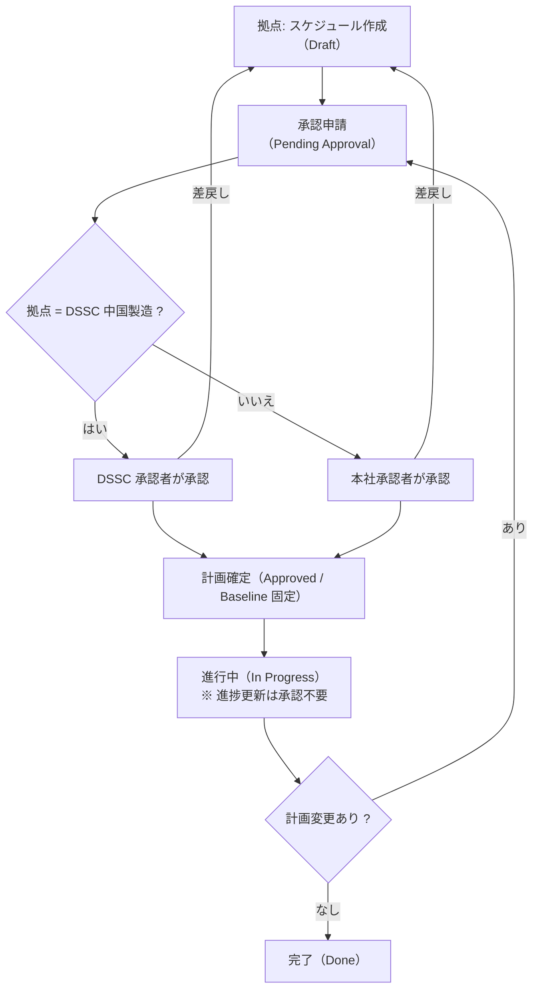

# JIRA における「案件管理」の定義 — 認識合わせドラフト

| 項目 | 内容 |
| --- | --- |
| 文書区分 | ドラフト（認識合わせ用・未確定） |
| 目的 | 「案件管理」という言葉の指す範囲と、JIRA 上での運用ルールについて関係者の認識を揃える |
| 対象読者 | 本社 管理部門 / 各拠点 案件担当・責任者 / DSSC（中国製造） |
| 版 | v0.1（初版ドラフト） |
| 位置づけ | 本書は決定事項ではありません。第 10 章「論点一覧」への回答をもって確定版とします |

---

## 1. 本書の狙い（コンサル観点）

ツール導入が定着しない典型的な原因は、ツールの設定ではなく **「何を管理するのか」「誰が決めるのか」が曖昧なまま導入すること** にあります。
したがって本書では、次の順序で定義します。この順序を逆にしない（＝ JIRA の画面から議論を始めない）ことが重要です。

```text
① 管理対象の定義（スコープ）
        ↓
② 業務フローと責任・承認の定義
        ↓
③ JIRA 上の実装（課題タイプ・項目・ワークフロー・権限）
        ↓
④ 運用ルール（更新頻度・報告サイクル・判定基準）
```

本書の基本方針は 3 点です。

1. **絞る** — 第 1 フェーズの管理対象は「進捗報告」と「課題管理」の 2 つに限定する。入力負荷を最小化し、まず定着させる。
2. **例外を仕組みに落とす** — DSSC（中国製造）の承認例外を「運用でカバーする例外」にせず、承認ルートの設定値として定義する。
3. **単一の情報源にする** — 進捗と課題の正は JIRA とし、報告資料は JIRA から生成する（二重管理をしない）。

---

## 2. 「案件管理」の定義（スコープ）

本取り組みにおける **案件管理 = ①進捗報告 ＋ ②課題管理** と定義します。

| # | 機能 | 定義 | 主な成果物 |
| --- | --- | --- | --- |
| ① | 進捗報告 | 案件のスケジュール（計画）を作成・承認し、実績・見込を更新して、計画との差異を可視化すること | ガントチャート、進捗一覧、遅延リスト |
| ② | 課題管理 | 案件の遂行を阻害する事象を起票し、担当・期限・解決状況を追跡し、必要に応じてエスカレーションすること | 課題一覧、エスカレーション報告 |

### 2.1 スコープ外（第 1 フェーズでは扱わない）

| 領域 | 扱い |
| --- | --- |
| 工数管理・原価/予算管理 | 対象外。JIRA に金額・工数の項目を持たない |
| 品質記録・検査記録 | 対象外。既存の品質システムを継続利用 |
| 図面・文書管理 | 対象外。リンク参照のみ可 |
| 要員リソース計画 | 対象外（担当者アサインは行うが、稼働率管理はしない） |
| 購買・発注管理 | 対象外。ただし「納期遅れ」は課題として起票する |

> **論点**：スコープ外領域を将来 JIRA に載せる可能性がある場合、項目設計時に拡張余地だけ残します（第 10 章 Q10）。

---

## 3. 管理単位（粒度）の定義

| 階層 | JIRA での表現 | 定義 | 登録者 | 承認 |
| --- | --- | --- | --- | --- |
| 案件 | Epic（案件） | 管理対象となる 1 つの取り組み。開始と終了、責任者が明確なもの | 拠点 案件担当 | — |
| フェーズ / 節目 | Milestone | 顧客・本社と約束した節目（設計完了、量産試作、量産開始 等） | 拠点 案件担当 | **要承認** |
| タスク | Task | フェーズを構成する実行単位。原則 1〜4 週間の粒度 | 拠点 案件担当 | 計画確定時のみ |
| 課題 | Issue（課題） | 案件の遂行を阻害する事象。案件 / タスクに紐付ける | 誰でも起票可 | 不要 |

**粒度の原則**：タスクは「週次で進捗が動くこと」を基準とします。1 週間で状態が変わらないタスクは粗すぎ、1 日で終わるタスクは細かすぎます。細かすぎる分解は更新されなくなり、形骸化の最大要因になります。

---

## 4. 現状フローと承認の定義

### 4.1 現状（As-Is）

- 各 **拠点** が案件のスケジュールを作成する
- **本社** がそのスケジュールを承認する
- ただし **DSSC（中国製造）** については、**自拠点で承認が完結** する

### 4.2 承認マトリクス（To-Be 定義案）

| 起案者 | 対象 | 承認者 | 本社の関与 |
| --- | --- | --- | --- |
| 拠点（DSSC 以外） | 初回スケジュール（計画確定） | 本社 | 承認 |
| 拠点（DSSC 以外） | 計画変更（マイルストーン日付の変更） | 本社 | 承認 |
| **DSSC 中国製造** | 初回スケジュール（計画確定） | **DSSC 承認者（自拠点）** | 参照・モニタリングのみ |
| **DSSC 中国製造** | 計画変更 | **DSSC 承認者（自拠点）** | 参照・モニタリングのみ |
| 全拠点 | 進捗更新（見込日・ステータス） | 承認不要 | 参照 |
| 全拠点 | 課題の起票・クローズ | 承認不要 | 重要度 High は通知 |

### 4.3 承認フロー図



### 4.4 例外（DSSC）の設計思想 — コンサル観点

DSSC の自拠点承認は「例外扱い」ではなく、**承認ルートのパラメータ** として定義することを推奨します。

| 悪い設計 | 推奨する設計 |
| --- | --- |
| 「DSSC だけは運用で本社承認を飛ばす」 | 「案件の *拠点* 項目の値によって、承認者ロールが自動的に切り替わる」 |
| 承認者を個人名でワークフローに埋め込む | 承認者を **ロール（グループ）** に紐付ける（`hq-approver` / `dssc-approver`） |
| 例外が増えるたびにワークフローを改造 | 承認権限テーブル（拠点 → 承認ロール）の値を変えるだけで済む |

これにより、将来他拠点へ承認権限を委譲する場合も **設定変更のみ** で対応でき、ワークフローの分岐が増殖しません。あわせて、DSSC 案件も本社が同じ画面・同じ項目で参照できるため、**承認権限は分けるが可視性は分けない** 状態を保てます。

---

## 5. JIRA 上の実装定義

### 5.1 課題タイプ（Issue Type）

| 課題タイプ | 用途 |
| --- | --- |
| 案件（Epic） | 案件そのもの |
| Milestone | 節目・約束日。ガント上は◆で表示 |
| Task | 実行単位 |
| Validation | 検証・試験工程（既存 CSV の Type に準拠） |
| 課題（Issue） | 阻害事象。案件 / タスクにリンク |

### 5.2 主要項目（フィールド）

既存のガントチャート出力ツール（`daicel/`）が読む CSV 列と整合させます。

| 項目 | JIRA 項目名 | 意味 | 必須 | 更新権限 |
| --- | --- | --- | --- | --- |
| キー | `Key` | 課題 ID | 自動 | — |
| 種別 | `Type` | 課題タイプ | ○ | 起票者 |
| 親 | `Parent` | 所属する案件 / フェーズ | ○ | 起票者 |
| 概要 | `Summary` | 名称 | ○ | 起票者 |
| 状態 | `Status` | ワークフロー状態 | ○ | 担当者 |
| 担当 | `Assignee` | 実行責任者 | ○ | 拠点 |
| **計画開始** | `Start Date` | 承認済ベースライン開始日 | ○ | **承認後は変更に再承認が必要** |
| **計画終了** | `Deadline` | 承認済ベースライン終了日 | ○ | **承認後は変更に再承認が必要** |
| 見込開始 | `Est Start` | 現時点の開始見込 | △ | 担当者（承認不要） |
| 見込終了 | `Est Deadline` | 現時点の終了見込 | △ | 担当者（承認不要） |
| 拠点 | `Site` | 起案拠点（承認ルート分岐に使用） | ○ | 拠点（初回のみ） |
| 遅延理由 | `Delay Reason` | 見込 > 計画 の場合に必須 | 条件付 | 担当者 |

**設計の要点**：`Start Date` / `Deadline`（＝承認された計画）と、`Est Start` / `Est Deadline`（＝現在の見込）を **分けて持つ** ことが、この設計の中核です。

- 計画を上書きしないため、**「いつ、どれだけ遅れたか」が記録として残る**
- 進捗更新（見込の更新）は承認不要とし、**日々の更新をブロックしない**
- 計画そのものを動かす時だけ承認プロセスに乗せる → 承認が「意味のある承認」になる

### 5.3 ワークフロー（スケジュール）

| 状態 | 意味 | 遷移できる人 |
| --- | --- | --- |
| Draft | 拠点が作成中 | 拠点 |
| Pending Approval | 承認待ち | 拠点（申請） |
| Approved | 計画確定（ベースライン固定） | 本社承認者 / DSSC 承認者 |
| Rejected | 差戻し | 本社承認者 / DSSC 承認者 |
| In Progress | 実行中 | 担当者 |
| On Hold | 保留 | 拠点責任者 |
| Done | 完了 | 担当者 |

### 5.4 ワークフロー（課題）

| 状態 | 意味 | 期限の考え方 |
| --- | --- | --- |
| Open | 起票済・未着手 | 起票から 2 営業日以内に担当者を確定 |
| In Progress | 対応中 | 期限（Due Date）必須 |
| Resolved | 対応完了・確認待ち | 起票者が確認 |
| Closed | クローズ | — |

### 5.5 権限グループ（案）

| グループ | 権限 |
| --- | --- |
| `site-planner-<拠点>` | 自拠点案件の作成・更新・承認申請 |
| `hq-approver` | 全拠点（DSSC 除く）の計画承認、全案件の参照 |
| `dssc-approver` | DSSC 案件の計画承認 |
| `viewer-all` | 全案件の参照（編集不可） |

---

## 6. 進捗報告の運用定義

| 項目 | 定義（案） |
| --- | --- |
| 更新責任者 | 各タスクの Assignee |
| 更新頻度 | **週次**（毎週金曜 17:00 まで） |
| 更新内容 | Status、`Est Start` / `Est Deadline`、遅延時は遅延理由 |
| 遅延の定義 | `Est Deadline` > `Deadline`（＝見込が承認済計画を超過） |
| 遅延時の対応 | 遅延理由の記入は必須。マイルストーンの遅延は課題として起票し、計画変更は再承認へ |
| 報告アウトプット | JIRA ダッシュボード（常時）＋ ガントチャート出力（月次報告用） |
| 月次会議アジェンダ | ①遅延案件、②今月クローズしたマイルストーン、③High 課題、④計画変更申請 |

**ガント出力**：JIRA から CSV をエクスポートし、本リポジトリの `daicel/` ツールで PNG / PPTX を生成します（[daicel/README.md](../daicel/README.md)）。報告資料を手作業で作らないことで、報告のために数値を作り直す運用を防ぎます。

---

## 7. 課題管理の運用定義

### 7.1 何を「課題」として起票するか

> **担当者が単独では、期限内に解決できない事象**

この基準を置く理由は、起票基準が曖昧だと「何でも課題」か「何も起票されない」のどちらかに振れるためです。判断に迷う場合は起票する側に倒します。

| 起票する | 起票しない |
| --- | --- |
| 部門・拠点をまたぐ調整が必要な事象 | 担当者が今日中に片付けられる作業 |
| マイルストーン遅延につながるリスク | 通常タスクの実施内容そのもの |
| 仕様・条件の未決事項 | 会議の議事メモ |
| 外部要因（供給遅延、規制対応 等） | — |

### 7.2 重要度と対応ルール

| 重要度 | 定義 | 初動 | エスカレーション |
| --- | --- | --- | --- |
| High | 顧客約束日・量産開始に影響する | 1 営業日以内に担当確定 | 起票後 2 営業日以内に本社へ通知 |
| Medium | 案件内の遅延に影響する | 3 営業日以内 | 週次報告で共有 |
| Low | 影響軽微・要観察 | 次回定例まで | 不要 |

### 7.3 案件との紐付け

課題は必ず案件（Epic）または該当タスクに紐付けます。紐付いていない課題は集計・報告に載らないため、起票時の必須条件とします。

---

## 8. 定着させるための最小ルール

現場運用を成立させるため、ルールは以下の 5 つに絞ることを推奨します。

1. 計画（`Start Date` / `Deadline`）は承認されたら勝手に変えない。変えるときは申請する。
2. 見込（`Est Start` / `Est Deadline`）は毎週金曜までに必ず更新する。
3. 遅れる見込になったら、遅延理由を書く。
4. 自分で解決できないことは課題として起票する。
5. 報告資料は JIRA から出す。JIRA の外で数字を作らない。

---

## 9. 導入ステップ（案）

| フェーズ | 内容 | 目安 |
| --- | --- | --- |
| Phase 0 | 本書の論点合意・定義確定 | 2〜3 週 |
| Phase 1 | JIRA 設定（課題タイプ・項目・ワークフロー・権限）／パイロット 1 拠点＋ DSSC | 4〜6 週 |
| Phase 2 | 全拠点展開、報告サイクルの切替（既存 Excel 報告の廃止） | 8〜12 週 |
| Phase 3 | 拡張検討（工数・原価等のスコープ外領域） | 別途 |

Phase 2 で **既存の報告様式を明示的に廃止する** ことが定着の分岐点です。並行運用が続くと、JIRA は「入力するだけの場所」になります。

---

## 10. 認識合わせが必要な論点（要回答）

| # | 論点 | 選択肢 / 確認事項 | 回答 |
| --- | --- | --- | --- |
| Q1 | 「案件」の登録基準 | 全件か、規模・金額・期間の閾値を設けるか | |
| Q2 | JIRA プロジェクト構成 | (a) 全社 1 プロジェクト＋拠点項目 ／ (b) 拠点別プロジェクト。横串集計とワークフロー統一の観点では (a) を推奨 | |
| Q3 | 計画変更の再承認閾値 | すべての日付変更で再承認か、○日以上のずれ・マイルストーンのみか | |
| Q4 | DSSC 例外の範囲 | 初回計画のみか、計画変更も含むか。本社への事後報告の要否 | |
| Q5 | 例外の横展開基準 | 他拠点へ自拠点承認を広げる条件（実績・体制など）は何か | |
| Q6 | ベースラインの扱い | 承認済計画は上書きせず履歴として残す前提でよいか | |
| Q7 | 拠点間の可視性 | 他拠点の案件を相互に参照可能とするか | |
| Q8 | 進捗更新の頻度 | 週次でよいか、拠点・案件種別によって変えるか | |
| Q9 | 報告サイクルと責任者 | 月次報告の実施タイミングと取りまとめ責任者 | |
| Q10 | 既存管理からの移行 | 進行中案件を移行するか、新規案件のみ JIRA 化するか | |

---

## 付録：用語定義

| 用語 | 定義 |
| --- | --- |
| 案件 | 開始・終了・責任者が明確な、管理対象となる取り組み（JIRA の Epic） |
| ベースライン（計画） | 承認された `Start Date` / `Deadline`。承認なしに変更しない |
| 見込 | 現時点の着地予想（`Est Start` / `Est Deadline`）。承認不要で随時更新 |
| マイルストーン | 顧客・本社と合意した節目の日付 |
| 課題 | 担当者が単独では期限内に解決できない、案件の阻害事象 |
| 拠点 | 案件を起案・実行する事業所。承認ルートの分岐キー |
| DSSC | 中国製造拠点。自拠点で計画承認が完結する |
